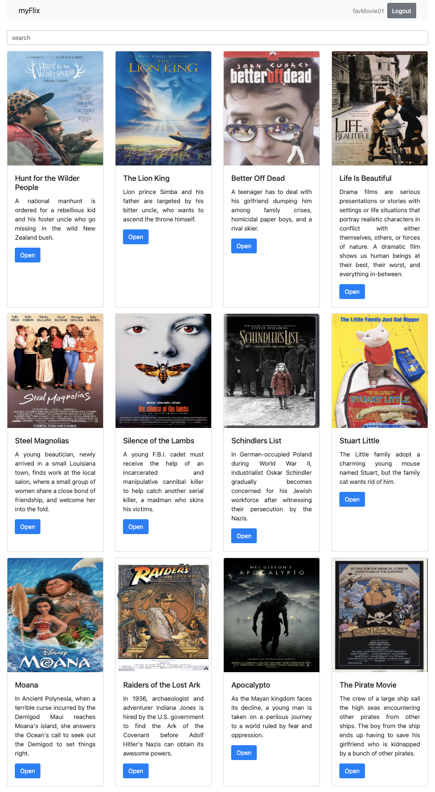

# myFlix-client

###### Using React, build the client-side for an application called myFlix based on its existing server-side code (REST API and database).[movie_api](https://github.com/leevee6039/movie_api)

A React Project using the hooks, react-redux for the state management, react-bootstrap for styles and react-router for routing.

## Technologies used:

- React
- Parcel-Bundler
- React-Bootstrap
- Axios
- React-Router
- React-Redux

---

Hosted on Netlify: https://leelas-my-flix.netlify.app/

# Getting Started

To get started with the myFlix App follow these steps.

## Prerequisites

Your system should have a NPM.

- npm
  `npm install npm@latest -g`

## Installation

Required installation to get started with the App, follow these steps.

Clone the repo
`git clone https://github.com/leevee6039/myFlix-client.git`

Install NPM packages
`npm install`

Start the app
`npm run start`

> Above steps if you get any error try to google

# Usage

Once the app starts you will see the login page, with Sign-up link on the navigation bar or below sign-in button

Go a head register after register login with your credentials.
